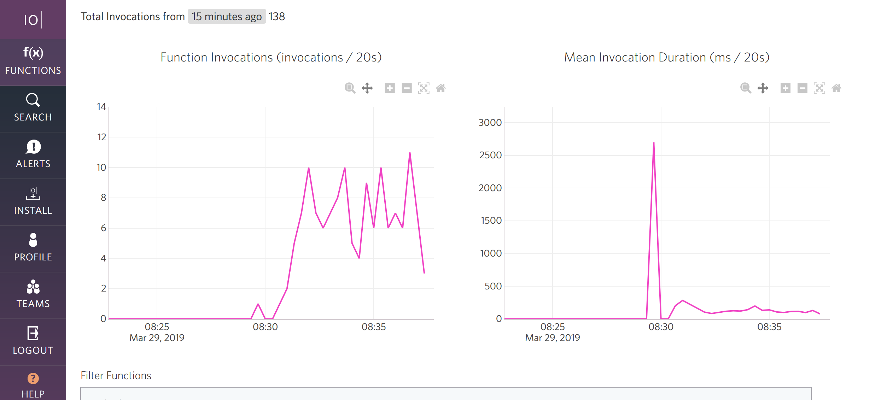
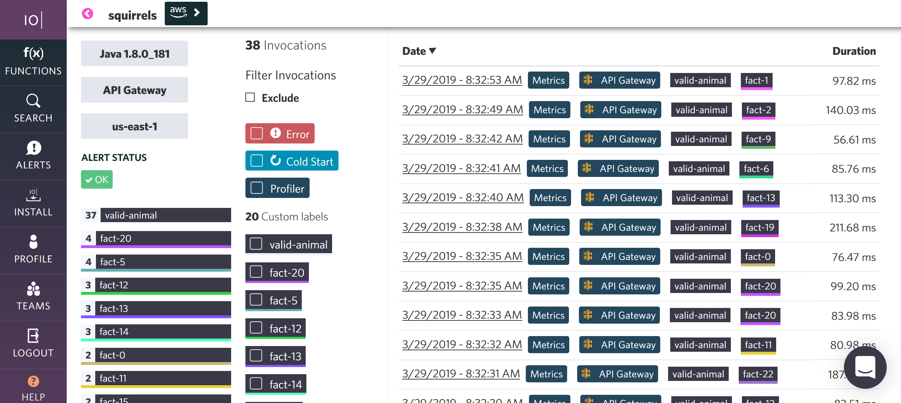
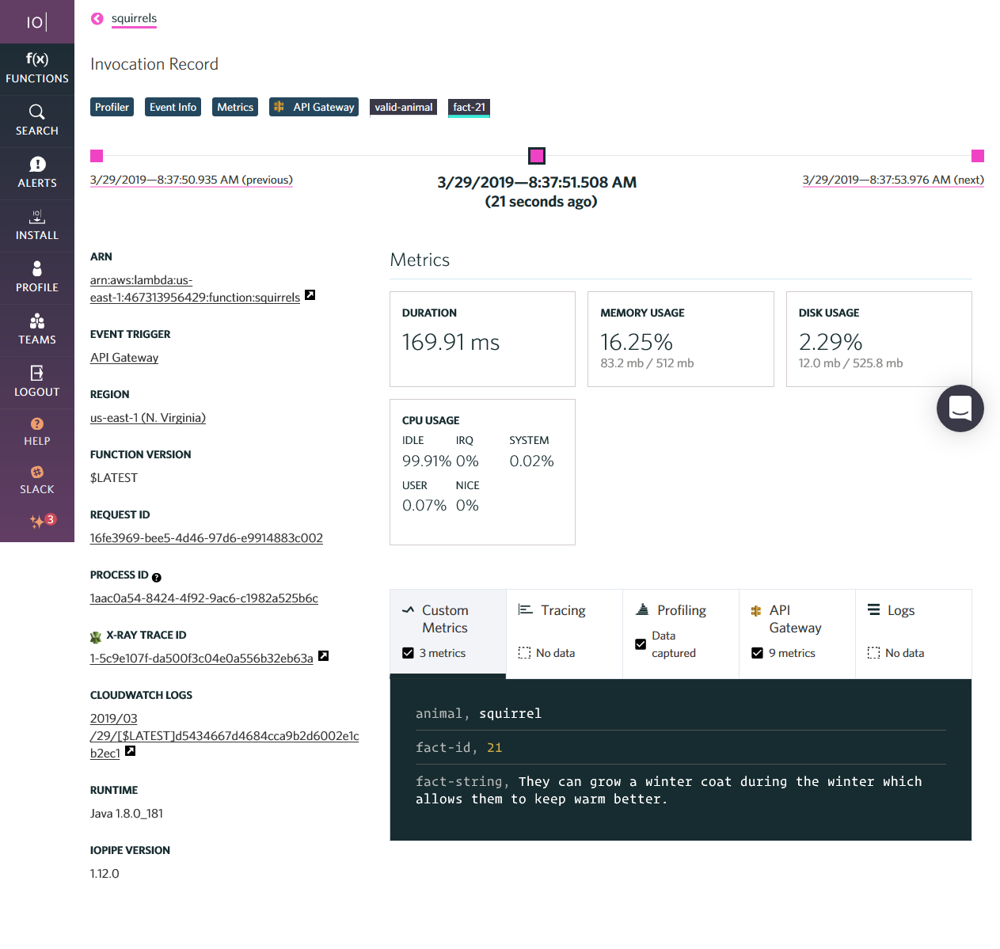
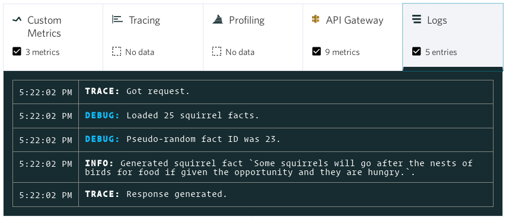
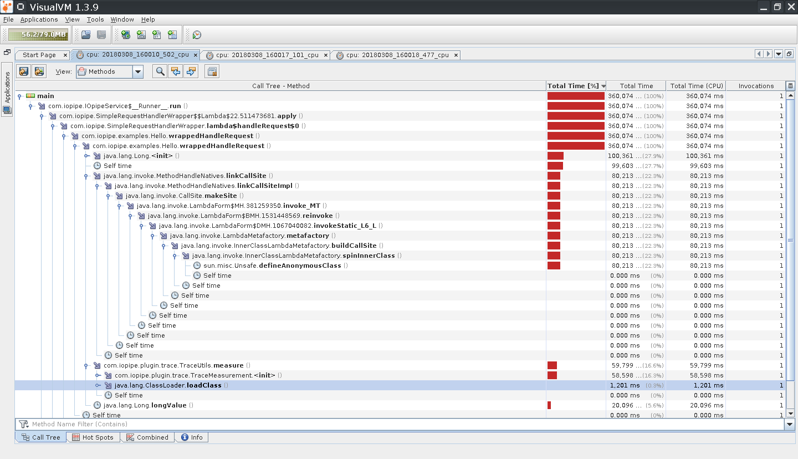

# IOpipe

 * [Website](https://iopipe.com/)
 * [Repository](https://github.com/XerTheSquirrel/iopipe-java)
   * [Upstream Repository](https://github.com/iopipe/iopipe-java)
   * [Plugin: Log4J2 Support](https://github.com/iopipe/iopipe-java-logger-log4j2)
   * [Plugin: TinyLog Support](https://github.com/iopipe/iopipe-java-logger-tinylog)
 * Language: **Java**
 * Tags: Amazon Web Services, CircleCI, Customer Support, Gradle, Java, JavaScript, JSON, JUnit, Linux, Maven, Profiling, QA Testing, REST APIs, Serverless API, Shell Scripting, VisualVM, XML, YAML
 * Duration:
   * Contracting: December 2017 to June 2018
   * Software Engineer (Full-Time): June 2018 to March 2019

The IOpipe Java agent allows you to measure and observe how your Java lambdas are running on [Amazon Web Services](https://aws.amazon.com/).

I developed the IOpipe Java agent which allows those who are using Java in AWS Lambda to view metrics on their invocations such as the duration of execution and errors. I implemented the agent along with its features such as profiling and logging following the direction of the other agents, which have previously implemented said features. I managed all of the project releases. I additionally provided technical support for the Java agent as well.

Any source code I wrote is fully documented with comments and is intended to be as concise as possible so that anyone, including myself, can go back into any part of the project and continue working on it. For each pull request made for any of the code that I write or have contributed to, I sometimes have paired with my manager to review that code. I have additionally created and/or reviewed other pull requests which were generally written in JavaScript, Go, and Python.

To ensure quality across the dashboard and the various agents I spearheaded what at the time was called QA Test Day which is a process that allows others to submit tasks to be tested along with general testing. I developed this process completely which includes how to submit tasks to be done and how to execute the tasks on the actual day in question. Other than QA Test Day, I regularly tested the dashboard and agents so that they can move into production.

While on the Engineering Team, I have been involved in a number of meetings on the architecture and direction of our product. My involvement in these meetings has never been specifically limited to my Java expertise, non-Java specific suggestions and thoughts have been iterated over and some of my ideas have been selected.

I have additionally written articles related to Java and AWS Lambda development on Medium. My most popular articles were Java Libraries are Your Lambda Enemy, and Optimizing AWS Java Lambdas, both of these are available in my list of publications.

# Technology Experience

This section contains specific experiences with technologies and is more fine grain than my general experience.

## Amazon Web Services (Lambda, S3, SQS, etc.)

IOpipe itself was made for Amazon Web Services and as such I learned how to configure and operate the various services. This mostly involved Lambda with API Gateway being the most common event, however other services such as S3 (file storage) and SQS (queue) were used as well.

## CircleCI (Continous Integration)

CircleCI was used very heavily at IOpipe which performed everything from testing, to releases, and to deployment of various parts of the service. I was responsible for making sure that CircleCI continued to work with the Java agent. There have been issues with CircleCI that I was able to resolve.

## Customer Support

I have provided customer support for the Java agent and other parts of IOpipe.

## Maven (including Maven Central)

The Java agent itself used Maven to build and test the project.

## Gradle

My usage of Gradle was mostly limited to making sure that one is able to use the IOpipe library in their Gradle projects, which of course an example was provided.

## JavaScript

I do have a working knowledge of JavaScript and I am able to review code that is written in JavaScript. I also am able to write small programs. I have written programs in JavaScript which are for internal use only and cannot be revealed.

## JSON

The entire IOpipe organization for the most part exclusively uses JSON, so this was very much often used. The agent itself generated JSON reports and sent them to the IOpipe service.

## JUnit (Testing)

The Java agent itself was tested using JUnit which was made available through Maven.

## REST APIs (HTTP POST, HTTP PUT, HTTP GET, etc.)

The Java Agent itself used POST and PUT operations. The POST operation was used to upload the invocation record in the JSON format, this record would then be made available on the dashboard so that the user can use it. The PUT operation was used for accessing the signer which was capable of receiving log files and profiler snapshots. Both of these do use an authentication token to prevent masquerading as another user.

To perform releases of the Java agent, shell scripts were written which utilizes the [BinTray API](https://bintray.com/docs/api/) to create new versions, upload all of the various files, publish the new version, then finally have it sync to the central [Maven Repository](https://search.maven.org/artifact/com.iopipe/iopipe/1.12.0/jar). The calls were essentially just performed using `curl` since the various operations were simple.

Additionally, I have created a [Squirrel Facts](https://github.com/iopipe/examples/blob/master/java/src/main/java/com/iopipe/examples/SquirrelFactsAPIGateway.java) demo ([there is a live request you can test](https://heoaa8bb8a.execute-api.us-east-1.amazonaws.com/squirrels/squirrels?animal=squirrel)).

## Serverless API

The [Serverless API](https://serverless.com/) was used setup the Amazon Web Services so that any generated Java or Javascript programs would be uploading and ready to execute as needed. Since IOpipe only runs on Amazon Web Services, this was the only service which was used.

## Shell Scripting

I have written a various number of shell scripts which for the most part have performed various repetitive tasks such as testing and performing releases. One of the larger scripts I have written is the one that is used to perform releases of the Java agent and [this script](https://github.com/XerTheSquirrel/iopipe-java/blob/master/.circleci/release.sh) was used to build and publish new versions.

## VisualVM

I used VisualVM to view the profiler snapshots which were generated by the agent along with performing profiling of the agent on my local system. This was used to determine which areas of the code needed improvement.

## XML

Although I do not prefer using XML, I have experience using it by creating the various project files for Maven.

# Releases

Releases were uploaded to BinTray which would sync to Maven Central allowing any developer to use them easily.

## Java Agent

These are releases which I have personally performed once I was hired as full-time:

 * [1.12.0](https://github.com/iopipe/iopipe-java/releases/tag/1.12.0) (February 25, 2018)
   * Added an extra environment variable for parity with other agents.
   * Corrected building with OpenJDK 11.
 * [1.11.0](https://github.com/iopipe/iopipe-java/releases/tag/1.11.0) (December 4, 2018)
   * This version is available as a Amazon Lambda Layer (which was revealed at the big Amazon conference).
   * Bug fixes, refactoring, and performance increases.
 * [1.10.1](https://github.com/iopipe/iopipe-java/releases/tag/1.10.1) (November 13, 2018)
   * Fixes a critical bug which caused a crash when the configuration resource was missing.
 * [1.10.0](https://github.com/iopipe/iopipe-java/releases/tag/1.10.0) (November 5, 2018)
   * Allowed configurations to be placed in the user's JAR file.
   * Added support for uploading log files.
 * [1.9.0](https://github.com/iopipe/iopipe-java/releases/tag/v1.9.0) (October 10, 2018)
   * Added support for uploading log files.
   * Bug fixes, refactoring, and performance increases.
 * [1.8.0](https://github.com/iopipe/iopipe-java/releases/tag/v1.8.0) (September 10, 2018)
   * Bug fixes, refactoring, and performance increases.
 * [1.7.0](https://github.com/iopipe/iopipe-java/releases/tag/v1.7.0) (August 28, 2018)
   * Added support for generic entry points which allows one to wrap their lambdas with no code modifications, so as such this adds support for wrapping Spring Cloud Framework.
   * Bug fixes, refactoring, and performance increases.
 * [1.6.0](https://github.com/iopipe/iopipe-java/releases/tag/v1.6.0) (August 7,  2018)
   * Added SQS Event support.
   * Bug fixes, refactoring, and performance increases.
 * [1.5.0](https://github.com/iopipe/iopipe-java/releases/tag/v1.5.0) (July 30, 2018)
   * Added functionality to automatically add labels under certain conditions.
   * Bug fixes, refactoring, and performance increases.
 * [1.4.0](https://github.com/iopipe/iopipe-java/releases/tag/v1.4.0) (June 28, 2018)
   * Add capturing of virtual machine statistics (such as garbage collection) to the profiling snapshot.

These releases were performed by _Pam Selle_ during the time I was a contractor:

 * [1.3.0](https://github.com/iopipe/iopipe-java/releases/tag/v1.3.0) (May 14, 2018)
   * Support for capturing certain lambda events such as _API Gateway_.
 * [1.2.0](https://github.com/iopipe/iopipe-java/releases/tag/v1.2.0) (April 23, 2018)
   * Support for labels.
 * [1.1.0](https://github.com/iopipe/iopipe-java/releases/tag/v1.1.0) (April 10, 2018)
   * Support for profiling then loading the profiler information into VisualVM.
 * [1.0.0](https://github.com/iopipe/iopipe-java/releases/tag/v1.0.0) (April 10, 2018)
   * First version!

## Log4J2 Plugin

 * [1.2.0](https://github.com/iopipe/iopipe-java-logger-log4j2/releases/tag/1.2.0) (February 25, 2018)
   * Updated dependencies.
   * Available as an AWS Lambda layer.
 * [1.1.0](https://github.com/iopipe/iopipe-java-logger-log4j2/releases/tag/1.1.0) (October 15, 2018)

## TinyLog Plugin

 * [1.2.0](https://github.com/iopipe/iopipe-java-logger-tinylog/releases/tag/1.2.0) (February 25, 2018)
   * Updated dependencies.
   * Available as an AWS Lambda layer.
 * [1.1.0](https://github.com/iopipe/iopipe-java-logger-tinylog/releases/tag/1.1.0) (October 15, 2018)

# Articles

This is a listing of all the articles I have written while working at IOpipe, note that articles which are not specific to IOpipe are my most popular articles:

## Logging your Java Invocations with IOpipe

 * [View on Medium](https://medium.com/p/cec15bdaf562)
 * November 14, 2018
 * 99 views, 49 reads

> Want access to your AWS Java Lambda logs without leaving the IOpipe dashboard? We now support this in Java if you are using Log4j2 and TinyLog!

## Quick And Easy Observability for AWS Java Lambda, No Code Changes!

 * [View on Medium](https://medium.com/p/d6938c3e3e6f)
 * November 9, 2018
 * 124 views, 77 reads

> Now you can add observability to your AWS Java Lambdas using IOpipe without needing to modify any of your code! It just takes a few steps!

## Optimizing AWS Java Lambdas

 * [View on Medium](https://medium.com/p/3ea2b872fe74)
 * October 31, 2018
 * 3.7k views, 1.3k reads

> If your Java lambdas are running slow, it can be a nightmare to find the culprit! This article will cover a bunch of tried and true tips that you can utilize to optimize your code so that it runs faster, or uses less memory.

## Monitoring your Spring Cloud Function with IOpipe

 * [View on Medium](https://read.iopipe.com/monitoring-your-spring-cloud-function-with-iopipe-58c6ed624073)
 * September 13, 2018
 * 238 views, 79 reads

> If you use the Spring Cloud Function framework, you can monitor executions of it using IOpipe. Starting with version 1.8.0 of the IOpipe Java agent you are able to wrap Spring Cloud Functions using the Generic Entry Point handler without making any modifications to your code!

##  Java Libraries are Your Lambda Enemy

 * [View on Medium](https://read.iopipe.com/java-libraries-are-your-lambda-enemy-6c9467321d2b)
 * August 23, 2018
 * 7.6K views, 2.9K reads

> So you are using AWS Lambda and your invocations seem to be running a bit slow, especially in the cold start area. Have you ever thought that this is caused by the libraries you are using? Java can be expensive on AWS Lambda, but it does not have to be at all.

# Recommendations Received

These are the recommendations which I have received while working for IOpipe. In last-name alphabetical order:

## Adam Johnson (CEO of IOpipe)

> Stephanie worked with us at IOpipe to build out our Java instrumentation library for AWS Lambda based serverless applications.  She built out the library from scratch and was very self driven the entire time. Throughout the project, Stephanie delivered incredibly high quality code.  She has deep knowledge of Java and and the JVM, and was able to solve numerous technical hurdles with the project.   Stephanie was able to work autonomously on the project with little oversight, while keeping the quality and attention to detail high.
> 
> If you're looking for a self driven engineer to work on any complex Java/JVM based work, look no further. 

## Pam Selle (Direct Manager)

> I worked with Stephanie on a project that was not only critical to our business, but where the source code would be open sourced, no small matter. Stephanie took direction well, received feedback very well, and was very responsive during the entirety of the project. I knew that when I asked Stephanie to work on something, or gave feedback for modifications, I could trust her to execute on it and she'd promptly let me know when things were ready for re-review. She worked well within our process, and I'd recommend working with her.

## Erica Windisch (CTO of IOpipe, Direct Manager)

> Stephanie is a fast and efficient developer that has exceeded our expectations. I began working with her when she was a junior engineer, but she quickly began solving difficult and complex problems as well as any of our senior staff.

# Screenshots

Some screen shots of the information captured by the agent visible in the IOpipe dashboard.

## Functions Page

How any running program will appear on the functions page.

## Function Page

A single function being executed, showing all of the invocations.

## Single Invocation Page

A single invocation, which is the lowest level of information.

## Old Logging Record

An old logging record that I made during development.

## Old Profiling Screenshot

This is a screenshot I made of the profiler output when I first started working on it in March of 2018.

