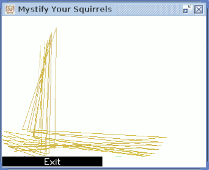
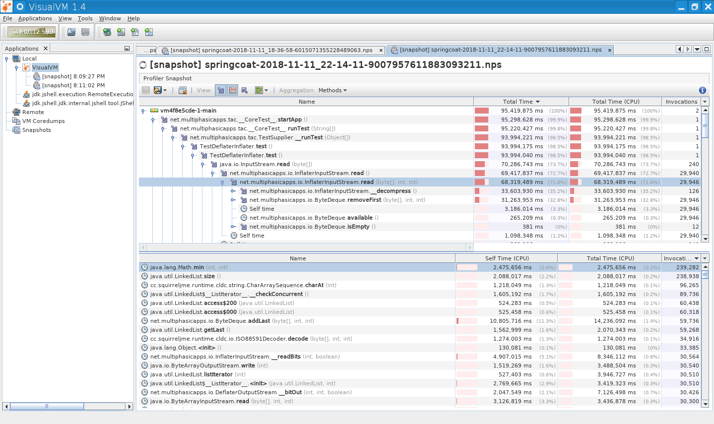

# SquirrelJME

 * [Website](https://squirreljme.cc/)
 * [Repository](https://github.com/XerTheSquirrel/SquirrelJME)
 * Language: **Java** (there will be a small port in **C**)
 * Duration: Active since February 2016

SquirrelJME is my main personal project which is an implementation of Java Micro Edition 8 written from the ground up. It is currently a work in progress but is capable of running existing MIDlets. The code is written completely in Java and is very much self contained, requiring no external dependencies.

# Screenshots and Examples

Of course this can actually run programs within the virtual machine! Below are a bunch of samples of programs which have been running which are more exciting than plain demos.

## Hello World and Virtual Machine Information (SpringCoat)

This is a basic hello world which prints out a message and some system properties which are defined within the virtual machine.

> ```
> Hello! Squirrels are so cute!
> java.version: 1.8.0
> java.vendor: Stephanie Gawroriski
> java.vendor.email: xerthesquirrel@gmail.com
> java.vendor.url: https://squirreljme.cc/
> java.vm.name: SquirrelJME SpringCoat
> java.vm.version: 0.2.0
> cc.squirreljme.apilevel: 0.2.0 (Day 359 of 2018)
> java.vm.vendor: Stephanie Gawroriski
> java.vm.vendor.email: xerthesquirrel@gmail.com
> java.vm.vendor.url: https://squirreljme.cc/
> java.runtime.name: SquirrelJME
> java.runtime.version: 0.3.0
> os.name: Linux
> os.arch: amd64
> os.version: 4.4.0-17763-Microsoft
> cc.squirreljme.vm.execpath: /tmp/sx/sjmeboot.jar
> cc.squirreljme.vm.freemem: 248523664
> cc.squirreljme.vm.totalmem: 268435456
> cc.squirreljme.vm.maxmem: 4253024256
> ```

## Mystify Your Squirrels!

This is based on a screen saver from Windows 3.1, which has since been replaced in Windows, and as such it brings back much memories. Due to SpringCoat being an unoptimized pure interpreter the animation on the VM is a bit slow, so it has been sped up in this picture.



## Profiling SpringCoat

SpringCoat has an internal profiler which in this screenshot you can see how slow a pure interpreter is, using this though I was able to write more efficient code. This is an old screenshot but it gets the point across.



# Releases

These are the releases of SquirrelJME, note that the release cycle aims to be around every 4 months.

## Upcoming

 * 0.4.0 (April 21, 2019)
   * Provides SummerCoat which is a more optimized register based virtual machine.
   * RatufaCoat is available as a port of SummerCoat to C.

## Released

 * [0.2.0](https://github.com/XerTheSquirrel/SquirrelJME/releases/tag/0.2.0) (December 25, 2018)
   * First release!
   * Provides SpringCoat

# Articles

## SquirrelJME, a new Java ME VM (Upcoming)

 * Expected April 21, 2019

> SquirrelJME is a small open source Java Virtual Machine which provides an implementation of Java Micro Edition. It is a small, fast, and light JVM without the overhead of a desktop installation of Java. It also can run old J2ME programs which were created for ancient flip phones, this includes games and other software. This is a work in progress and as time progresses more software will be supported.
