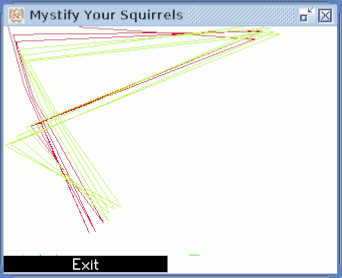

# SquirrelJME

 * [Website](https://squirreljme.cc/)
 * [Repository](https://github.com/XerTheSquirrel/SquirrelJME)
 * Language: **Java** (there will be a small port in **C**)
 * Duration: Active since February 2016

SquirrelJME is my main personal project which is an implementation of Java Micro Edition 8 written from the ground up. It is currently a work in progress but is capable of running existing MIDlets. The code is written completely in Java and is very much self contained, requiring no external dependencies.

Java ME is a subset of Java SE which is designed for small embedded systems and portable devices. The most common implementation of it is the older J2ME standard which runs on a wide number of old flip phones. It has a number of limitations compared to Java on the desktop which makes it have much less impact on systems.

SquirrelJME uses its own run-time library (classes such as `java.lang.String` and `java.util.LinkedList`) which have been written from scratch. Although there are a number of run-times that already exist such as OpenJDK and Apache Harmony, these are not designed with small underpowered systems in mind. As such, much consideration needs to be put in to ensure that the code executes fast while also not using much memory since SquirrelJME will be running on resource constrained systems.

There is a [project board](https://github.com/XerTheSquirrel/SquirrelJME/projects) which details the current state of SquirrelJME and anything which either needs to be done, is in progress, or is completed.

# Virtual Machines

SquirrelJME currently consists of multiple virtual machines which are iteratively being written. Any experience and knowledge gained from writing a virtual machine is used to write the next one. There will however be ending point virtual machines which will just see small improvements since most of the work needed is in the run-time library.

## SpringCoat (Pure Interpreter)

SpringCoat is a very basic and niave implementation of the Java Virtual Machine. It is not designed to be maintainable because its main purpose is for me to learn and to figure out how the virtual machine operates as a whole so that future virtual machines will be more efficient and better written.

The speed of SpringCoat is very slow because it handles the Java stack itself and directly executes Java Byte Code without performing any kind of translations or optimizations.

SpringCoat is first available in SquirrelJME 0.2.0 and it will be deprecated in SquirrelJME 0.6.0 to be removed completely in SquirrelJME 0.8.0.

## SummerCoat (In Progress, Compiled Register Interpreter)

SummerCoat is the next iteration and uses the knowledge gained from SpringCoat. Instead of directly executing Java Byte Code, it is first recompiled into a register based instruction set which not only results in less instructions being generated but more efficient code. The code density of SummerCoat's executable code is about half of Java Byte Code, so if the basic assumption that a single instruction takes a single cycle then SummerCoat will be about twice as fast as SpringCoat. However, SummerCoat has a number of optimizations which will vastly improve its speed over SpringCoat. SummerCoat will not execute native code, it will only execute this register based instruction set.

SummerCoat is a long-term virtual machine which will first appear in SquirrelJME 0.4.0, since the register based code will be very important for later virtual machine steps this one will stick around and be the root ancestor for future virtual machines.

## RatufaCoat (Future VM, Compiled Register Interpreter)

RatufaCoat is a port of SummerCoat to the C language which will allow normal C programs to utilize SquirrelJME to run Java code. It for the most part will appear in RetroArch which is a game platform for emulation and such.

RatufaCoat is a long-term virtual machine which will first appear in SquirrelJME 0.4.0. This will be the virtual machine that will be available for RetroArch. The virtual machine may see improvements from WinterCoat potentially.

## AutumnCoat (Future VM, Compiled Native Code)

This virtual machine will take the base of what was done in SummerCoat and transform it into native code, like SpringCoat this will be written as a learning process to see how things should work. This will generate an independent executable of SquirrelJME.

## WinterCoat (Future VM, Compiled Native Code)

This is the final virtual machine which once AutumnCoat has been written, will use the knowledge gained from it to generate native machine code so that SquirrelJME will be an independent executable.

# Screenshots and Examples

Of course this can actually run programs within the virtual machine! Below are a bunch of samples of programs which have been running which are more exciting than plain demos.

## Hello World and Virtual Machine Information (SpringCoat)

This is a basic hello world which prints out a message and some system properties which are defined within the virtual machine.

> ```
> Hello! Squirrels are so cute!
> java.version: 1.8.0
> java.vendor: Stephanie Gawroriski
> java.vendor.email: xerthesquirrel@gmail.com
> java.vendor.url: https://squirreljme.cc/
> java.vm.name: SquirrelJME SpringCoat
> java.vm.version: 0.2.0
> cc.squirreljme.apilevel: 0.2.0 (Day 359 of 2018)
> java.vm.vendor: Stephanie Gawroriski
> java.vm.vendor.email: xerthesquirrel@gmail.com
> java.vm.vendor.url: https://squirreljme.cc/
> java.runtime.name: SquirrelJME
> java.runtime.version: 0.3.0
> os.name: Linux
> os.arch: amd64
> os.version: 4.4.0-17763-Microsoft
> cc.squirreljme.vm.execpath: /tmp/sx/sjmeboot.jar
> cc.squirreljme.vm.freemem: 248523664
> cc.squirreljme.vm.totalmem: 268435456
> cc.squirreljme.vm.maxmem: 4253024256
> ```

## Mystify Your Squirrels!

This is based on a screen saver from Windows 3.1, which has since been replaced in Windows, and as such it brings back much memories. Due to SpringCoat being an unoptimized pure interpreter the animation on the VM is a bit slow, so it has been sped up in this picture. The code which I have written includes the methods used to draw the actual lines that you see here.



## Profiling SpringCoat

SpringCoat has an internal profiler which in this screenshot you can see how slow a pure interpreter is, using this though I was able to write more efficient code. This is an old screenshot but it gets the point across. The code being profiled in this screenshot is for the Inflate algorithm, this algorithm is used in decompressing ZIP and GZip files or used for compressing websites when downloading them.


# Releases

These are the releases of SquirrelJME, note that the release cycle aims to be around every 4 months.

## Upcoming

 * 0.4.0 (April 21, 2019)
   * Provides SummerCoat which is a more optimized register based virtual machine.
   * RatufaCoat is available as a port of SummerCoat to C.

## Released

 * [0.2.0](https://github.com/XerTheSquirrel/SquirrelJME/releases/tag/0.2.0) (December 25, 2018)
   * First release!
   * Provides SpringCoat

# Articles

## SquirrelJME, a new Java ME VM (Upcoming)

 * Expected April 21, 2019

> SquirrelJME is a small open source Java Virtual Machine which provides an implementation of Java Micro Edition. It is a small, fast, and light JVM without the overhead of a desktop installation of Java. It also can run old J2ME programs which were created for ancient flip phones, this includes games and other software. This is a work in progress and as time progresses more software will be supported.
